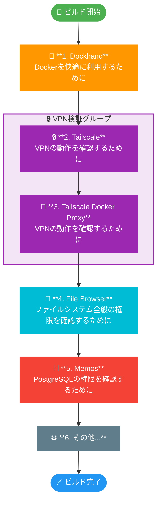

# Docker Projects

## Port management and resource usage
| Service | Port | TSD Proxy | ram_container_uses_mib | disk_image_uses_mib |
| --- | --- | --- | --- | --- |
| DatHub | 5173 | 5173 | 20 | 650 |
| Devbox | - | - | - | - |
| AdGuard Home | 46073 | 80 | - | - |
| Dockhand | 3100 | 3100 | 70 | 635 |
| File Browser | 8180 | 8180 | 12 | 52 |
| Grafana | 3000 | 36411 | - | - |
| Immich | 2283 | 2283 | 750 | 4096 |
| Jellyfin | 8096 | 8096 | 182 | 2048 |
| Kavita | 5000 | 38977 | - | - |
| Komga | 25600 | 25600 | - | - |
| Memos (SQLite) | 5230 | 5230 | - | - |
| Memos Postgres | 5240 | 5240 | 43 | 700 |
| Memos Postgres Staging | 5241 | 5241 | 43 | 700 |
| Netdata | 19999 | 19999 | 17 | 1490 |
| n8n | 5678 | 5678 | - | - |
| Obsidian | 8090 | 8090 | - | - |
| Qdrant | 6334 | 6334 | - | - |
| Syncthing | 8384 | 8384 | 17 | 60 |
| Tailscale | - | - | 18 | 157 |
| Tailscale Docker Proxy | - | - | 17 | 82 |
| Vaultwarden | 8000 | 8000 | 8 | 316 |

## Recommendable Build Flow

